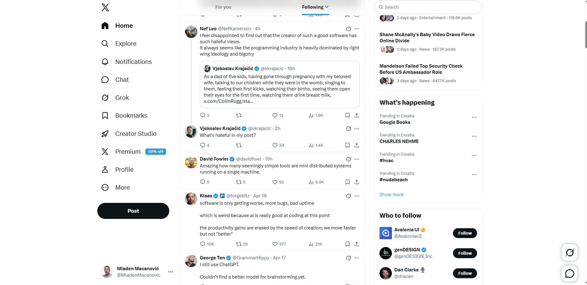

# Blazorise X Clone

**Blazorise X Clone** is an open-source project that recreates a familiar X/Twitter-style interface using [Blazorise](https://blazorise.com).
The goal is to showcase how far you can take Blazorise components and the Tailwind provider to build a polished social feed UI in Blazor.

---

## Features

- X/Twitter-like UI built with **Blazorise**
- Tailwind provider setup with Blazorise utilities
- Left navigation, central feed, and right discovery rail
- Profile, notifications, and chat screens
- Fictional timeline, profile, notification, and conversation data
- Component-driven Blazor project
- No custom CSS

---

## Example



---

## Getting Started

### 1. Restore dependencies

```bash
dotnet restore
```

### 2. Run the project

```bash
dotnet run --project BlazoriseTwitterClone/BlazoriseTwitterClone.csproj --launch-profile http
```

Then open:

```text
http://localhost:5023
```

### 3. Build the project

```bash
dotnet build BlazoriseTwitterClone/BlazoriseTwitterClone.csproj
```

## Theming

Blazorise X Clone uses the Blazorise Tailwind provider.

- To customize the UI, prefer Blazorise components and utility parameters.
- Keep layout and styling in Razor markup with helpers such as `Flex`, `Padding`, `Margin`, `Gap`, `Background`, `TextColor`, `TextSize`, `TextWeight`, `Width`, `Height`, and `Border`.
- Do not add custom CSS unless the project requirements change.

## Port Conflicts

If port `5023` is already in use, check the process:

```powershell
netstat -ano | Select-String ':5023'
```

If the process is a stale `BlazoriseTwitterClone` instance, stop it by PID:

```powershell
Stop-Process -Id <PID> -Force
```

You can also run on another port:

```bash
dotnet run --project BlazoriseTwitterClone/BlazoriseTwitterClone.csproj --urls http://localhost:5090
```

## Contributing

Contributions are welcome.

Feel free to fork the repo, open issues, or submit pull requests with improvements.

## License

This project is free for everyone and licensed under the MIT License.

You are free to use, modify, and distribute it.

## Disclaimer

Blazorise X Clone is an independent open-source project. It is not affiliated with, endorsed by, or connected to X Corp. or Twitter in any way.

This project is provided "as is" without warranty of any kind. The authors and contributors are not liable for any damages arising from the use of this project.

## Acknowledgments

- [Blazorise](https://blazorise.com) - the UI framework powering this project
- [Tailwind CSS](https://tailwindcss.com) - utility-first styling foundation used by the Blazorise Tailwind provider
